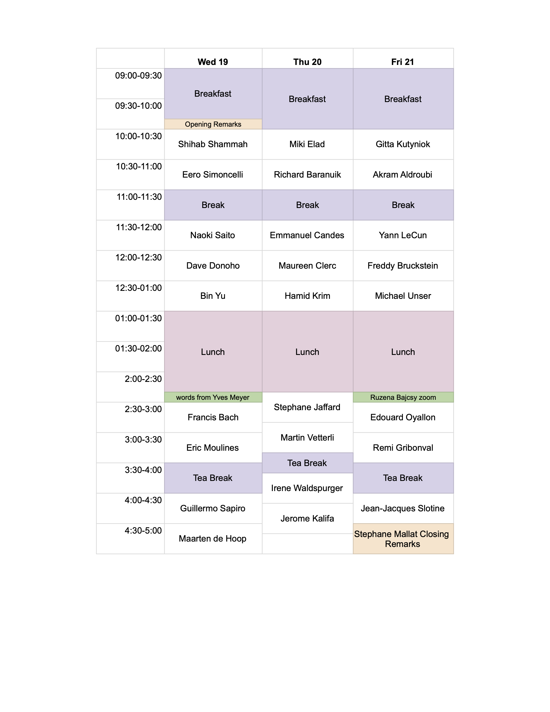

Abstracts: 
----

**Akram Aldroubi**, Vanderbilt University 
_Title:_ Dynamical Sampling And Frames 
_Abstract:_ Dynamical sampling is a term describing an emerging set of problems related to recovering signals and evolution operators from space-time samples. For example, consider the abstract IVP in a separable Hilbert space H: du/dt=Au+F. When, F=0, A is a known (or unknown) operator, and the goal is to recover u0 from the samples {u(ti,xj)} on a sampling set {(ti,xj)}, we get the so called space-time sampling problems. If the goal is to identify the operator A, or some of its characteristics, we get the system identification problems. If instead we wish to recover F, we get the source term problems. In this talk, I will present an overview of dynamical sampling, and some open problems. 
_Keywords:_ sampling, frames, signal processing, system identification.

**Richard Baranuik**, Rice University 
_Title:_ A Spline Tour of Deep Learning: The Scattering Way. 
_Abstract:_ Over the past decade, deep (neural) networks trained using massive data sets have enabled remarkable progress on a wide range of challenging computational problems, from pattern recognition and image synthesis to language translation and protein folding.  Nevertheless, this progress has been alchemistic and driven largely by empirical observations, hacks, and tricks. Fundamental questions remain, such as:  Why do deep learning methods work?  When do they work?  And how can they be fixed when they don’t work?  Intuitions abound, but a coherent framework for understanding, analyzing, and synthesizing deep learning architectures remains elusive. This talk will discuss the implications of this lack of understanding for consumers, practitioners, and researchers of machine learning.  We will also briefly overview recent progress towards a theory of deep learning based on rigorous mathematical principles.  Of the several promising avenues of research, we will focus on the connection between deep networks and spline approximation that provides a geometric interpretation for how deep networks organize and process data.  A particularly interesting special case is provided by the Scattering Network. 
_Keywords:_ Spline, deep learning, scattering transform.

**Francis Bach**, Inria, ENS  
_Title:_ The quest for adaptivity  
_Abstract:_ Most machine learning classes and textbooks mention that there is no universal supervised learning algorithm that can do reasonably well on all learning problems. Indeed, a series of “no free lunch theorems” state that even in a simple input space, for any learning algorithm, there always exists a bad conditional distribution of outputs given inputs where this algorithm performs arbitrarily bad. Such theorems do not imply that all learning methods are equally bad, but rather that all learning methods will suffer from some weaknessess. In this talk, I present and contrast the weaknesses and strengths of popular methods such as k-nearest-neighbor, kernel methods, and neural networks.

**Richard Baranuik**, Rice University  
_Title:_ A Spline Tour of Deep Learning: The Scattering Way. 
_Abstract:_ Over the past decade, deep (neural) networks trained using massive data sets have enabled remarkable progress on a wide range of challenging computational problems, from pattern recognition and image synthesis to language translation and protein folding.  Nevertheless, this progress has been alchemistic and driven largely by empirical observations, hacks, and tricks. Fundamental questions remain, such as:  Why do deep learning methods work?  When do they work?  And how can they be fixed when they don’t work?  Intuitions abound, but a coherent framework for understanding, analyzing, and synthesizing deep learning architectures remains elusive. This talk will discuss the implications of this lack of understanding for consumers, practitioners, and researchers of machine learning.  We will also briefly overview recent progress towards a theory of deep learning based on rigorous mathematical principles.  Of the several promising avenues of research, we will focus on the connection between deep networks and spline approximation that provides a geometric interpretation for how deep networks organize and process data.  A particularly interesting special case is provided by the Scattering Network. 

**Freddy Bruckstein**, Technion 
_Title:_ Holographic Data Representations. 
_Abstract:_ Holographic representations of data encode information in packets of equal importance that enable progressive recovery. The quality of recovered data improves as more and more packets become available. This progressive recovery of the information is independent of the order in which packets become available. Such representations are ideally suited for distributed storage and for the transmission of data packets over networks with unpredictable delays and or erasures. (Talk based on joint work with A. Netravali, Bob Holt, Fred Ezerman, Ling San, Adamas Fahreza, Yehuda Dar over the years  1998-2022). 
_Keywords:_ Distributed Data Representations, Stochastic Data Models, Holographic Properties

**Emmanuel Candès**, Stanford University 
_Title:_ A Taste of conformal prediction 
_Abstract:_ Conformal inference methods are becoming all the rage in academia and industry alike. In a nutshell, these methods deliver exact prediction intervals for future observations without making any distributional assumption whatsoever other than having iid, and more generally, exchangeable data. This talk will review the basic principles underlying conformal inference and survey some major contributions that have occurred in the last 2-3 years or. We will discuss enhanced conformity scores applicable to quantitative as well as categorical labels. If time allows, we will also survey novel methods which deal with situations, where the distribution of observations can shift drastically. 
_Keywords:_ conformal inference, statistics, machine learning.

**Maureen Clerc**, INRIA 
_Title:_ Human attention and communication mediated via machine learning 
_Abstract:_ The beauty of wavelets is that they are intuitively graspable, while being grounded in deep mathematical foundations. As Gabor wavelets are representative of visual perceptive fields, wavelets have been used to model biological principles of vision. Wavelets have in turn proved useful to extract information from brain activity,  by focusing on repeating patterns that emerge from noise. While machines are particularly apt at recognizing repetitive patterns, humans are expert at detecting departures from regularity. Neural markers related to departures from regularity are correlates of human attention, independently of sensory modality. Machines can be trained to measure this trace of attention in neural signals, which can provide novel ways to mediate communication between humans. 
_Keywords:_ visual perception, maching learning, wavelets, neuroscience.

**Maarten De Hoop**, Rice University 
_Title:_ Geometry, topology and discrete symmetries revealed by deep neural networks. 
_Abstract:_ A natural question at the intersection of universality efforts and manifold learning is the following: What kinds of architecture are universal approximators of maps between manifolds that are topologically interesting? A (low-dimensional) manifold hypothesis has been underlying the study of inverse problems ensuring Lipschitz stability, implying a like-wise hypothesis for data. This is used, for example, in inference through flows. By exploiting the topological parallels between locally bilipschitz maps, covering spaces, and local homeomorphisms, we find that a novel network of the form p o E, where E is an injective flow and p a coordinate projection, is a universal approximator of local diffeomorphisms between compact smooth (sub)manifolds embedded in Euclidean spaces. We show that the network allows for the computation of multi-valued inversion and that our analysis holds in the interesting case when the target map between manifolds changes topology and its degree is a priori not known. We also show that the network can be used, for example, in supervised problems for recovering the group action of a group invariant map if the group is finite, and in unsupervised problems by informing the choice of topologically expressive starting spaces in the generative case. 
_Keywords:_ Deep learning, manifold learning, invariances.

**David Donoho**, Stanford University 
_Title:_ The bridge from mathematical to digital, and back 
_Abstract:_ Stephane Mallat has, across 30 years, evolved continuously as the fields of computational harmonic analysis, signal processing and image processing
have evolved. Starting out writing papers in Math journals like Trans Amer Math Soc, he recently has written papers for the leading conferences in empirical machine learning.  The transition that Stéphane has made is something we should all learn from, but I’m afraid many of us will not be able to understand or emulate. Indeed today there are vast differences in mindset and worldview between the mathematical and the digital communities.  They literally do not understand each other. I will describe the differences in mindsets and worldviews and provide a few travel tips for those people who would like to go on the bridge from mathematical to digital, or vice versa. (related to a manuscript under preparation with  Matan Gavish, Hebrew University) 
_Keywords:_ machine learning, signal processing.

**Miki Elad**, Technion 
_Title:_ The New Era of Image Denoising 
_Abstract:_ Image denoising is one of the oldest and most studied problems in image processing. An extensive work over several decades has led to thousands of papers on this subject, and to many well-performing algorithms for this task. As expected, the era of deep learning has brought yet another revolution to this subfield, and took the lead in today’s ability for noise suppression in images. This talk focuses on recently discovered abilities and opportunities of image denoisers. We expose the possibility of using image denoisers for serving other problems, such as regularizing general inverse problems and serving as the engine for image synthesis. We also unveil the (strange?) idea that denoising and other inverse problems might not have a unique solution, as common algorithms would have you believe. Instead, we describe constructive ways to produce randomized and diverse high perceptual quality results for inverse problems. 
_Keywords:_ signal processing, image processing, machine learning, denoising.

**Remi Gribonval**, ENS Lyon 
_Title:_ Rapture of the deep: highs and lows of sparsity in a world of depths. 
_Abstract:_ Promoting sparse connections in neural networks is natural to control their complexity. Besides, given its thoroughly documented role in inverse problems and variable selection, sparsity also has the potential to give rise to learning mechanisms endowed with certain interpretability guarantees. Through an overview of recent explorations around this theme, I will compare and contrast classical sparse regularization for inverse problems with multilayer sparse approximation. During our journey, I will notably highlight the role of rescaling-invariances in deep parameterizations, which come with their curses and blessings. In the process we will also be remembered that there is life beyond gradient descent, as illustrated by an algorithm that brings speedups of up to two orders of magnitude when learning certain fast transforms via multilayer sparse factorization.. 

**Stéphane Jaffard**, Université Paris-Est 
_Title:_ Random Fourier series   vs.  random  wavelet series 
_Abstract:_ The huge success of wavelet bases was the consequence of two key properties:  On one hand, the general framework of multiresolution analysis, built  by Stéphane Mallat, which led to the fast decomposition/reconstruction algorithms and to the  construction of compactly supported wavelets by Ingrid Daubechies;  and, on other hand,  the characterization of large classes of function spaces by simple conditions on wavelet coefficients, worked out by Yves Meyer (often referred to as the ``multiplier property'') and  which had direct and practical consequences in  statistics and in signal and image processing. These characterizations imply that the norm of a function is not greatly modified if its  wavelet coefficients suffer  perturbations,  which guarantees the numerical robustness of the reconstruction of a function from it wavelet coefficients,  in sharp contradistinction with Fourier series. We will expose  surprizing consequences of this property, which implies  that  the regularity properties of random wavelet series strongly differ from   those of random Fourier series. 
_Keywords:_ Fourier transform, wavelet transform, multiresolution analysis.

**Jerome Kalifa**  
_Title:_ A data science startup - Let It Wave’s meandering adventure, and its duller sisters. 
_Abstract:_ In 2001, Stéphane Mallat founded Let It Wave with three of its students. The startup went through a fast-paced series of transformations, turning from its initial consulting activities to an ambitious fabless in consumer electronics for HDTV. A semi-success, the company is a good case study of a startup that originated from academic research.
This talk is the story of Let It Wave from its origins, Le Pennec’s thesis on bandlets, to its acquisition in 2008. As this adventure turned me into a serial entrepreneur rather than an academic, I will also briefly present the duller and wiser Lixoft, another company originating from research in statistics for clinical studies, and more recent projects stemming from data science. 
_Keywords:_ startup, signal processing, video upscaling.

**Hamid Krim**, NCSU, Raleigh NC 
_Title:_ Learning with Volterra Series (VNNs) 
_Abstract:_ Machine Learning (ML) has reached an unprecedented performance in various inference problems arising in practice. The sample complexity and that of the model have, however, increasingly emerged as a serious limitation. Given the importance of a number of problems where these issues are central, we have revisited the Conv-net fundamental principle and have reformulated it from a Volterra Series perspective using a polynomial functional paradigm*. We propose a computational Convolutional Network solution which requires no activation function and provides a very competitive inference performance (often better) at a fraction of the sample and model complexity of the most competitive CNN architecture. * Homogeneous Polynomial Functional were first developed and formalized by Frechet. 
_Keywords:_ machine learning,  Volterra Series, sampling complexity, polynomials.

**Gitta Kutyniok**,  LMU Munich 
_Title:_ Reliable AI: From Applied Harmonic Analysis to Quantum Computing 
_Abstract:_ The new wave of artificial intelligence is impacting industry, public life, and the sciences in an unprecedented manner. In mathematics, it has by now already led to paradigm changes in several areas. However, one current major drawback is the lack of reliability of such methodologies. In this talk, we will focus on the key aspects of reliability of deep neural networks, namely generalization and explainbility, and discuss a complete generalization result in the setting of graph neural networks and a novel explainbility approach based on applied harmonic analysis. Finally, we will briefly touch upon limitations as well, show that from a computability viewpoint digital hardware causes a serious problem for reliability, and reveal a surprising connection to novel computing approaches such as quantum computing. 
_Keywords:_ harmonic analysis, machine learning, quantum computing.

**Yann Le Cun**, NYU and Meta 
_Title:_ TBA. 
_Abstract:_ TBA. 
_Keywords:_

**Eric Moulines, Ecole Polytechnique** 
_Title:_ Sampling through Exploration Exploitation. 
_Abstract:_ We develop an explore-exploit Markov chain Monte Carlo algorithm (Ex2MCMC) that combines multiple global proposals and mobile moves. The proposed method is massively parallelizable and extremely computationally efficient. We prove the V-uniform geometric ergodicity of Ex2MCMC under realistic conditions and compute explicit bounds on the mixing rate showing the improvement due to multiple global moves. We show that Ex2MCMC allows fine-tuning of exploitation (local moves) and exploration (global moves) via a novel approach to propose dependent global moves. Finally, we develop an adaptive scheme, FlEx2MCMC, that learns the distribution of global trains through normalizing flows.
We illustrate the efficiency of Ex2MCMC and its adaptive versions in many classical sampling benchmarks. We also show that these algorithms improve the quality of sampling GANs as energy-based models. 
_Keywords:_ machine learning, sampling, Markov chain Monte Carlo.

**Edouard Oyallon**, CNRS 
_Title:_ Exploring Shallow Architectures for Image Classification. 
_Abstract:_ Deep Convolutional Neural Networks (CNNs) have achieved remarkable success in various tasks, particularly in image classification. In contrast, Scattering Networks, a two-layer deep CNN architecture derived from cascaded complex wavelet transforms and modulus
 pointwise non-linearity, have shown promise but lag behind deep CNNs in terms of performance on the widely recognized ImageNet dataset In this talk, we revisit the central question that drove my PhD research: "Is it possible to derive competitive representations for image classification using geometric arguments?" Although this inquiry did not yield the desired outcome, it sparked an intriguing research direction focusing on the potential of shallow architectures in tackling the ImageNet dataset. We will review these findings and discuss potential challenges in the area of shallow learning. 
_Keywords:_ deep learning, shallow architectures, scattering transform.
 

**Naoki Saito**, UC Davis 
_Title:_ Multiscale basis dictionaries and scattering networks on simplicial complexes 
_Abstract:_ I will discuss multiscale basis dictionaries, in particular, the Hierarchical Graph Laplacian Eigen Transform (HGLET) and the Generalized Haar-Walsh Transform (GHWT), which my group originally developed for analyzing signals measured on nodes of an input graph, but which we have recently generalized for signals defined on edges, triangles, tetrahedra, etc. of a given simplicial complex using the Hodge Laplacians. These dictionaries consist of redundant sets of multiscale basis vectors and the corresponding expansion coefficients of a given signal. These provide a large number of orthonormal bases among which one can select the most suitable basis for one's task using the best-basis algorithm and its relatives.
I will also discuss how to construct scattering networks for signals on simplicial complexes using the HGLET and the GHWT. Our new scattering networks cascade the moments (up to fourth order) of the modulus of the dictionary coefficients followed by the local averaging process. Consequently, the resulting features are robust to perturbations of input signals and invariant w.r.t. node permutations. I will demonstrate the usefulness of these dictionaries using the coauthorship/citation complex and the Science News article classification. This is joint work with Stefan Schonsheck and Eugene Shvarts. 
_Keywords:_ machine learning, scattering transform, graphs.

**Guillermo Sapiro**, Duke 
_Title:_ A Large-Scale Observational Study of the Causa Effects of a Behavioral Health Nudge 
_Abstract:_ Nudges are interventions promoting healthy behavior without forbidding
options or significant incentives; the Apple Watch, for example,
encourages users to stand by delivering a notification if they have
been sitting for the first 50 minutes of an hour. Based on 76 billion
minutes of observational standing data from 160,000 subjects
in the public Apple Heart and Movement Study, we estimate the
causal effect of this notification using a novel regression discontinuity
design for time-series data with time-varying treatment. We show
that the nudge increases the probability of standing by up to 43.9%,
and remains effective with time. The nudge’s effectiveness increases
with age and it is independent of gender. Closing Apple Watch Activity
Rings, a visualization of participants’ daily progress in Move,
Exercise, and Stand, further increases the nudge’s impact. This work
demonstrates the effectiveness of behavioral health interventions and
introduces tools for investigating their causal effect from observations.
Joint work with Achille Nazaret. 
_Keywords:_ causality, medicine, signal processing, machine learning.

**Shihab Shamma**, UMD  
_Title:_ The Rainbow Connection. 
_Abstract:_ Stephane has contributed enormously to Auditory Neuroscience and Computations, although he has not isolated a single-cell, or recorded an EEG or MEG!  Stephane’s influence is powerful and intellectual. He has unknowingly shaped the way we view the cochlea, its encoding of sound, its journey to and through the auditory cortex, and how auditory neuroscientists assess the encoded information and reconstruct it. I shall explain to you and to Stephane why he really should be viewed as a foremost auditory practitioner!  
_Keywords:_ Audio processing, machine learning, neurosciences.

**Eero Simoncelli**, NYU 
_Title:_ Photographic Image Priors in the Era of Machine Learning. 
_Abstract:_ Inverse problems in image processing and computer vision are often solved using prior probability densities, such as spectral or sparsity models.  In recent years, machine learning has provided dramatic improvements in most of these problems using artificial neural networks, which are typically optimized using nonlinear regression to provide direct solutions for each specific task.  As such, the prior probabilities are implicit, and intertwined with the tasks for which they are optimized.  I'll describe properties of priors implicitly embedded in denoising networks, and describe methods for drawing samples from them.  Extensions of these sampling methods enable the use of the implicit prior to solve any deterministic linear inverse problem, with no additional training, thus extending the power of a supervised learning for denoising to a much broader set of problems. The method relies on minimal assumptions, exhibits robust convergence over a wide range of parameter choices, and achieves state-of-the-art levels of unsupervised performance for deblurring, super-resolution, and compressive sensing. 
_Keywords:_ Inverse problems, machine learning, deblurring, super-resolution. 

  
**Jean-Jacques Slotine**, MIT 
_Title:_ Stable adaptation and learning 
_Abstract:_ The human brain still largely outperforms robotic algorithms in most tasks, using computational elements 7 orders of magnitude slower than their artificial counterparts. Similarly, current large scale machine learning algorithms require millions of examples and close proximity to power plants, compared to the brain's few examples and 20W consumption. We study how modern nonlinear systems tools, such as contraction analysis, virtual dynamical systems, and adaptive nonlinear control can yield quantifiable insights about collective computation and learning in large dynamical networks. For instance, we show how stable implicit sparse regularization can be exploited in adaptive prediction or control  to select relevant dynamic models out of plausible physically-based candidates, and how most elementary results on gradient descent based on convexity  can be replaced by much more general results based on Riemannian contraction. 
_Keywords:_ neuroscience, machine learning, neural networks, sparsity.

**Michael Unser**,  EPFL 
_Title:_ Advanced computational imaging: "Chassez le naturel, il revient au galop". 
_Abstract:_ Deep neural networks have a remarkable ability to improve the quality of reconstruction of biomedical images. While the results reported so far are extremely encouraging, serious reservations have been voiced pertaining to the stability of these tools and the extent to which we can trust their output. After providing an overview of the state-of-the-art, we describe iterative reconstruction schemes that rely on stable Lipschitz-constrained networks with learnable activation functions. We then identify some not-so-deep neuronal architectures that yield near state-of-the-art performance, while offering theoretical guarantees (convergence, consistency with the measurements, stability) that protect them against hallucinations. We also display a configuration that has a variational interpretation and whose components (filters and nonlinearities) are reminiscent of the wavelets and multiresolution decompositions introduced by Stéphane Mallat. 
_Keywords:_ Computational imaging, deep learning, wavelets, multiresolution.

**Martin Vetterli**, EPFL 
_Title:_ Lippmann Photography: The Art and Science of Multispectral Imagery 
_Abstract:_ Gabriel Lippmann won the 1908 Nobel Prize in Physics for colour photography. 
It is actually the first example of multispectral imaging. We provide a complete analysis of the process and show, both theoretically and experimentally, what spectrum is reflected from a Lippmann plate.  An algorithmic recovery of the original spectrum is proposed, as well as a digital version of Lippmann photography. We discuss the application to high density permanent three-dimensional storage, and finish with an example of science communication for the general public. Joint work with Gilles Baechler, Arnaud Latty, Michalina Pacholska,  Paolo Prandoni and Adam Scholefield. References: 1. Gilles Baechler, Arnaud Latty, Michalina Pacholska, Martin Vetterli, and Adam Scholefield,  “Shedding light on 19th century spectra by analyzing Lippmann photography,”  PNAS, April 27, 2021, Vol. 118, No. 17. ; 2.  Gilles Baechler, Arnaud Latty, Michalina Pacholska, Martin Vetterli, and Adam Scholefield,  “Lippmann Photography: A Signal Processing Perspective,”  IEEE Tr. on SP, July 2022. 
_Keywords:_ computational imaging, multispectral imaging, science communication.

**Irene Waldspurger**, CNRS and Univ. Dauphine 
_Title:_ Sketching semidefinite programs for super-resolution problems. 
_Abstract:_ In this talk, we will consider the canonical example of a super-resolution problem: the recovery of a measure on [0;1] from its first Fourier coefficients, assuming that the measure is the sum of a few spikes. Under weak assumptions, it is known that the measure to be recovered is the solution of a convex infinite-dimensional problem, which is in turn equivalent to a semidefinite program. This property yields a polynomial-time reconstruction algorithm with strong correctness guarantees. Unfortunately, the size of the semidefinite program can be extremely large, even when the measure contains a very small number of spikes. I will present a sketching approach to reduce this size. Proving that this approach retains the correctness guarantees is still an ongoing work. I will present a byproduct of our efforts to find a proof, namely an algorithm to automatically find (simple) upper bounds on some integrals with parameters. This work is a collaboration with Augustin Cosse and Gabriel Peyré. 
_Keywords:_ Super-resolution, optimization, sparsity.

**Bin Yu** UC Berkeley 
_Title:_ Interpreting Deep Neural Networks towards Trustworthiness. 
_Abstract:_ In this talk, I will start by describing our contextual decomposition (CD) method to interpret neural networks, which attributes importance to features and feature interactions for individual predictions. Using CD to interpret DL models in a cosmology problem led us to develop an adaptive wavelet distillation (AWD) interpretation method. AWD is shown to be both outperforming deep neural networks and interpretable in the motivating cosmology problem and an external validating cell biology problem. Finally, I will address the need to quality-control the entire data science life cycle to build any model for trustworthy interpretation. 
